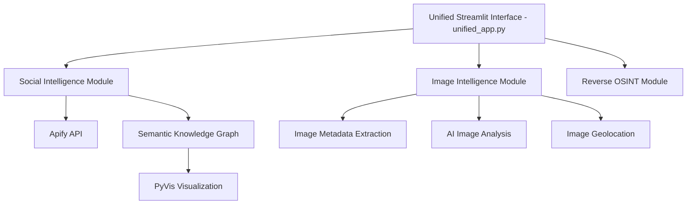
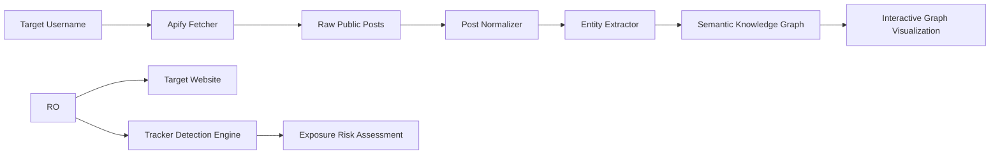
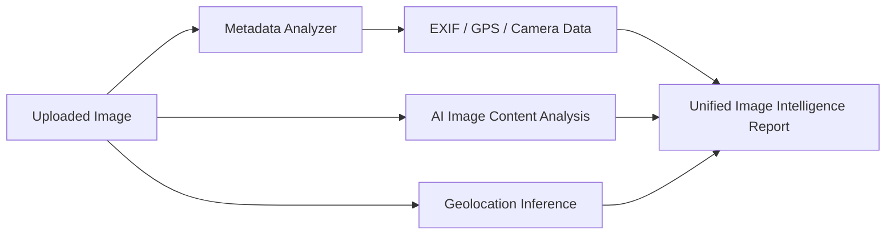
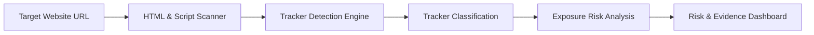

# Unified OSINT Intelligence Platform

A modular, multi-capability **Open-Source Intelligence (OSINT)** platform that unifies **Social Intelligence**, **Image Intelligence**, and **Reverse OSINT** into a single **Streamlit-based analytical system**.

This project is designed for **academic evaluation**, **security research**, and **ethical OSINT demonstrations**, focusing exclusively on **publicly available data**.

---

## Key Capabilities

### 1. Social Intelligence
- Collects publicly available social media content using **Apify actors**
- Normalizes posts into structured intelligence signals
- Extracts entities such as **locations** and **timestamps**
- Builds **confidence-weighted semantic knowledge graphs**
- Interactive visualization using **PyVis**

---

### 2. Image Intelligence
- Image metadata extraction (**EXIF**, **GPS**, camera details)
- AI-assisted visual content interpretation
- Image-based geolocation inference
- Unified forensic view for image analysis

---

### 3. Reverse OSINT (Website Intelligence)
- Detects third-party tracking technologies on websites
- Categorizes trackers (**Analytics**, **Advertising**, **Session Replay**)
- Provides exposure risk and tracking severity assessment
- Explains implications of detected tracking behavior

---
## System Architecture

The Unified OSINT Intelligence Platform follows a **modular, layered architecture** where independent intelligence modules are orchestrated through a unified Streamlit interface.

### Social Intelligence – Data Flow

The Social Intelligence module focuses on transforming **publicly available social media data** into structured intelligence insights.

The workflow begins with a target identifier (e.g., username or keyword), which is processed by an Apify-based data fetcher. Raw posts are then normalized to remove noise and standardize formats. An entity extraction layer identifies relevant intelligence signals such as locations, timestamps, and relationships.

These extracted entities are mapped into a **semantic knowledge graph**, enabling relationship discovery and contextual analysis. The final output is rendered as an **interactive graph visualization**, supporting exploratory OSINT analysis.

---

### Image Intelligence – Analysis Pipeline 

The Image Intelligence module performs **multi-dimensional forensic analysis** on uploaded images.

Metadata analysis extracts EXIF information such as GPS coordinates, camera model, and timestamps. In parallel, AI-based image content analysis and geolocation inference are executed to derive contextual insights from visual patterns.

All analytical outputs are consolidated into a **unified image intelligence report**, providing a holistic view of both technical metadata and inferred intelligence signals. This parallel-processing design improves accuracy and analytical depth.

---

### Reverse OSINT – Website Intelligence Flow Explanation

The Reverse OSINT module analyzes **publicly visible website components** to infer privacy and tracking exposure.

The process begins with scanning HTML and embedded scripts from a target website. Detected third-party trackers are identified and classified based on their functional categories, such as analytics or advertising.

A risk assessment layer evaluates the potential privacy exposure associated with detected trackers. The final results are presented through a **risk and evidence dashboard**, enabling transparent and explainable website intelligence analysis.

---
### Architectural Design Rationale

- **Modularity:** Enables independent development and testing of intelligence modules  
- **Loose Coupling:** Prevents cascading failures across modules  
- **Ethical OSINT:** Operates strictly on publicly accessible information  
- **Explainability:** Every intelligence output is traceable to its source  
- **Extensibility:** Architecture supports future OSINT capabilities without redesign  

